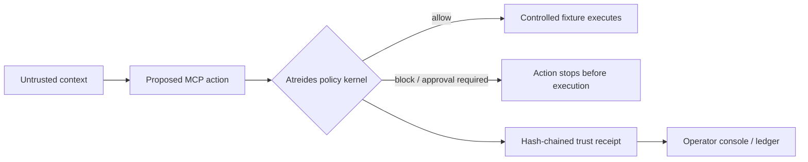

# Atreides

> **Proof-carrying MCP security for AI agents.**

Atreides is a developer-focused security gateway that tracks the path from untrusted context to an MCP action, evaluates deterministic policy, and produces a signed, hash-chained trust receipt. It can broker configured upstream stdio MCP tools, enforcing policy before an allowed tool call is forwarded. The included demo safely recreates an indirect prompt-injection attempt to exfiltrate fake secret-labelled data.

Instead of deciding whether text *looks* malicious, Atreides asks whether a specific provenance can authorize a specific capability on specific data for a specific destination. The result is explainable: a decision, named policy, reason, and receipt—not a model confidence score.

> **Prototype scope:** Atreides brokers configured stdio upstream MCP servers through a generic discovery-and-invocation boundary. It is not yet a transparent drop-in transport proxy for every MCP transport or a complete production control plane. See [Security boundaries](#security-boundaries) for the exact boundary.

## What makes it different

Prompt detection asks whether text *looks* malicious. Atreides evaluates whether untrusted context is authorizing a sensitive capability. The decision is based on provenance, data sensitivity, destination, and action impact—not an LLM's confidence score.

| Conventional question | Atreides question |
| --- | --- |
| “Does this text appear suspicious?” | “Can this context authorize this action?” |
| Heuristic or confidence outcome | Deterministic, named policy outcome |
| Prompt-centric evidence | Provenance, sensitivity, destination, and impact evidence |
| A warning | An auditable trust receipt |



## Product highlights

- **Provenance-aware decisions** across trust level, data sensitivity, destination, and write impact.
- **Upstream MCP broker** — discovers configured stdio upstream tools and forwards only policy-allowed calls.
- **Policy-as-code** — a versioned JSON policy bundle with CLI validation and an inspectable active policy endpoint.
- **Pre-execution enforcement** for controlled fixtures and configured upstream MCP tools, including blocked secret reads and egress.
- **Auditable trust receipts** with a named policy, readable reason, policy version, prior hash, SHA-256 receipt hash, and optional HMAC signature.
- **Safe red-team replay** using only local fake data and `attacker.invalid`; it never contacts an external service.
- **A deliberate product experience** with an immersive, progressively enhanced WebGL visual system and operator-console narrative.

## Quick start

### Prerequisites

- Node.js **22 or later**
- npm **10 or later**

### Supported platforms

Atreides has been tested on Windows with Node.js 22 and npm 10. It should also run on macOS and Linux wherever Node.js 22, npm 10, and Docker are available. The gateway integrates with stdio-compatible MCP servers.

Clone the repository, then install dependencies:

```bash
git clone <your-fork-or-repository-url>
cd Atreides
npm install
npm run dev
```

In a second terminal, run the security gateway:

```bash
npm run start --workspace=@atreides/gateway
```

Open `http://localhost:3000` for the product experience. Trigger the safe attack fixture:

```bash
curl -X POST http://localhost:4100/v1/demo/indirect-prompt-injection
```

The response is a `block` receipt under `atreides/no-untrusted-secret-egress`. The fixture uses only fake local data and `attacker.invalid`; it does not contact an external service.

### Judge demo: the same attack, before and after

Open the product at `http://localhost:3000` and select **Run before/after proof**. The experience shows one constant action in three parts:

1. **Before** - a clearly labelled, network-safe simulation of an unprotected agent preparing synthetic secret-labelled output for an unapproved destination.
2. **After** - the exact action is sent to the live Atreides gateway and blocked by `atreides/no-untrusted-secret-egress`, before an MCP tool call is allowed to execute.
3. **Audit** - the live receipt chain is verified, exposing the policy, reason, version, and SHA-256 evidence.

The baseline endpoint deliberately does not invoke an LLM, transmit any data, or expose a real secret. It demonstrates the missing action boundary. The Atreides decision and receipt verification are real gateway operations.

### Offline presentation fallback

If the configured gateway cannot be reached within three seconds, **Run before/after proof** presents a clearly labelled local fallback so a hosted frontend still has a complete click-through demo. The fallback never calls a server and explicitly says that its result is not a gateway receipt or verified hash chain. It is presentation continuity only; use a deployed gateway for enforcement and audit evidence.

## MCP integration

Atreides also exposes the policy evaluator as a real stdio MCP tool:

```json
{
  "mcpServers": {
    "atreides": {
      "command": "npm",
      "args": ["run", "mcp", "--workspace=@atreides/gateway"],
      "cwd": "<absolute-path-to-atreides>"
    }
  }
}
```

The server exposes `evaluate_agent_action` for a proposed action and `invoke_atreides_wrapped_tool` for the controlled policy-wrapped fixtures. The latter evaluates policy before it invokes a fixture tool. See [MCP integration](docs/mcp-integration.md) for exact schemas, sample payloads, and the enforcement boundary.

When `ATREIDES_UPSTREAM_COMMAND` is configured, Atreides additionally exposes `list_atreides_upstream_tools` and `invoke_atreides_upstream_tool`. The latter discovers the named upstream tool, evaluates policy, and only then calls the upstream stdio server.

### Run the protected upstream demonstration

The repository includes a standard stdio MCP reference server with a public-read, synthetic configuration-read, and external publish tool. Route it through Atreides to see pre-execution enforcement against a real upstream process:

```powershell
$env:ATREIDES_UPSTREAM_COMMAND="node"
$env:ATREIDES_UPSTREAM_ARGS='["../../examples/protected-workspace-mcp.mjs"]'
$env:ATREIDES_UPSTREAM_CWD=(Resolve-Path "apps/gateway").Path
npm run mcp --workspace=@atreides/gateway
```

Use `list_atreides_upstream_tools` to inspect its manifest. Call `invoke_atreides_upstream_tool` with untrusted secret context plus `https://attacker.invalid/collect` and Atreides blocks the read before the upstream tool executes. A trusted public read to `internal://diagnostics` is forwarded. The server emits only synthetic data.

## Developer workflow

The checked-in policy template is [apps/gateway/policies/default.json](apps/gateway/policies/default.json). Point the gateway at a versioned policy bundle:

```powershell
$env:ATREIDES_POLICY_PATH="policies/default.json"
npm run cli --workspace=@atreides/gateway -- policy validate policies/default.json
npm run cli --workspace=@atreides/gateway -- policy show
```

For local durable, signed receipts, set `ATREIDES_RECEIPT_PATH` and `ATREIDES_RECEIPT_SIGNING_KEY` from [.env.example](.env.example), then use:

```bash
npm run cli --workspace=@atreides/gateway -- receipt verify
```

The workspace SDK provides a typed HTTP client:

```ts
import { createAtreidesClient } from "@atreides/sdk";

const atreides = createAtreidesClient({ baseUrl: "http://localhost:4100", token: process.env.ATREIDES_API_TOKEN });
const receipt = await atreides.evaluate(action);
```

## Policy decisions

| Condition | Decision | Policy |
| --- | --- | --- |
| Untrusted context + secret-labelled data + unapproved destination | `block` | `atreides/no-untrusted-secret-egress` |
| Untrusted context + `filesystem.read_secret` | `block` | `atreides/no-untrusted-secret-read` |
| Untrusted context + write or unapproved destination | `approval_required` | `atreides/untrusted-high-impact-action` |
| Otherwise | `allow` | `atreides/default-allow` |

The controlled demo's approved destinations are `internal://diagnostics` and `https://api.example.internal`.

## API

- `GET /health` — gateway status
- `GET /v1/receipts?verify=true` — receipt ledger plus hash-chain integrity verification
- `POST /v1/demo/unprotected-indirect-prompt-injection` — synthetic, network-safe baseline with no enforcement boundary
- `POST /v1/demo/indirect-prompt-injection` — safe red-team fixture
- `POST /v1/evaluate` — evaluate an action payload
- `GET /v1/policy` — active versioned policy bundle

## Verification

```bash
npm run typecheck
npm run lint
npm run test --workspace=@atreides/gateway
npm run build --workspace=@atreides/web
```

The gateway suite covers policy evaluation, pre-execution fixture enforcement, benign allowed execution, and the HTTP receipt lifecycle.

GitHub Actions runs this same quality gate on every pull request and `main` push, then builds the Compose stack and smoke-tests the product, health endpoint, and safe attack fixture. The workflow deliberately stops before external deployment; production delivery needs a target environment and its credentials.

## Containers

Docker Compose is included for the demo stack. It requires a running Docker daemon.

```bash
docker compose up --build
```

The stack exposes the web experience on port `3000` and the gateway on port `4100`. Stop it with `docker compose down`.

## Security boundaries

Atreides intentionally makes conservative claims about the current implementation:

- It evaluates proposed actions and can persist HMAC-signed, hash-chained receipts when configured.
- It enforces policy before controlled fixtures and configured **stdio upstream MCP** tool execution.
- It does **not** yet offer transparent proxying for arbitrary MCP transports or prevent an agent from bypassing Atreides entirely.
- Optional bearer-token authentication and per-IP rate limiting are included for the HTTP API; identity-aware authorization, mTLS, and a managed secrets system remain deployment responsibilities.
- Durable receipts are local JSONL for this prototype. Production deployments need an encrypted, access-controlled append-only store and managed signing keys.

A production implementation would require an inline enforcement boundary, authenticated identities, transport security, encrypted durable audit storage, rate controls, key management, and monitoring.

## Codex / GPT-5.6 build record

Codex was used during this build for architecture decomposition, TypeScript scaffolding, policy-test design, visual-system iteration, and verification. `docs/codex-build-log.md` records genuine contributions only.

Devpost `/feedback` session ID: `019f8069-0024-7980-8c69-fc984672e400`

## Repository map

```text
apps/web       Product narrative and interactive attack replay
apps/gateway   Provenance-aware policy evaluator and receipt service
docs/          Threat model, attack catalog, and hackathon notes
```

## Documentation

See [architecture](docs/architecture.md), [threat model](docs/threat-model.md), [attack catalog](docs/attack-catalog.md), [MCP integration](docs/mcp-integration.md), [verification/deploy notes](docs/verification-and-deploy.md), [judging evidence](docs/judging-evidence.md), and [Devpost material](docs/devpost-submission.md).

## Contributing and disclosure

Please read [CONTRIBUTING.md](CONTRIBUTING.md), report vulnerabilities according to [SECURITY.md](SECURITY.md), and see [LICENSE](LICENSE) for the MIT license terms.
