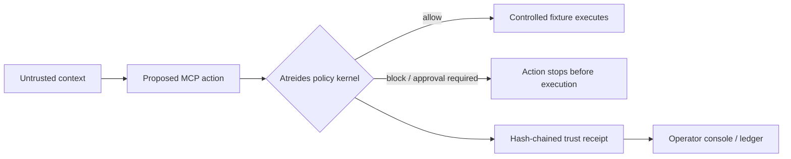

# Atreides

> **Proof-carrying MCP security for AI agents.**

Atreides is a developer-focused security gateway that tracks the path from untrusted context to an MCP action, evaluates deterministic policy, and produces a hash-chained trust receipt. Its controlled wrapped-tool demo enforces that decision before fixture execution. It is a safe local demonstration of indirect prompt injection attempting to exfiltrate fake secret-labelled data.

Instead of deciding whether text *looks* malicious, Atreides asks whether a specific provenance can authorize a specific capability on specific data for a specific destination. The result is explainable: a decision, named policy, reason, and receipt—not a model confidence score.

> **Prototype scope:** Atreides is a working pre-execution evaluator with controlled wrapped-tool enforcement. It is not an inline proxy for arbitrary third-party MCP servers. See [Security boundaries](#security-boundaries) for the exact boundary.

## What makes it different

Prompt detection asks whether text *looks* malicious. Atreides evaluates whether untrusted context is authorizing a sensitive capability. The decision is based on provenance, data sensitivity, destination, and action impact—not an LLM's confidence score.

| Conventional question | Atreides question |
| --- | --- |
| “Does this text appear suspicious?” | “Can this context authorize this action?” |
| Heuristic or confidence outcome | Deterministic, named policy outcome |
| Prompt-centric evidence | Provenance, sensitivity, destination, and impact evidence |
| A warning | An auditable trust receipt |



## Product highlights

- **Provenance-aware decisions** across trust level, data sensitivity, destination, and write impact.
- **MCP-compatible tooling** through a real local stdio MCP server.
- **Pre-execution enforcement** for controlled fixtures, including blocked secret reads and egress.
- **Auditable trust receipts** with a named policy, readable reason, prior hash, and SHA-256 receipt hash.
- **Safe red-team replay** using only local fake data and `attacker.invalid`; it never contacts an external service.
- **A deliberate product experience** with an immersive, progressively enhanced WebGL visual system and operator-console narrative.

## Quick start

### Prerequisites

- Node.js **22 or later**
- npm **10 or later**

Clone the repository, then install dependencies:

```bash
git clone <your-fork-or-repository-url>
cd Atreides
npm install
npm run dev
```

In a second terminal, run the security gateway:

```bash
npm run start --workspace=@atreides/gateway
```

Open `http://localhost:3000` for the product experience. Trigger the safe attack fixture:

```bash
curl -X POST http://localhost:4100/v1/demo/indirect-prompt-injection
```

The response is a `block` receipt under `atreides/no-untrusted-secret-egress`. The fixture uses only fake local data and `attacker.invalid`; it does not contact an external service.

## MCP integration

Atreides also exposes the policy evaluator as a real stdio MCP tool:

```json
{
  "mcpServers": {
    "atreides": {
      "command": "npm",
      "args": ["run", "mcp", "--workspace=@atreides/gateway"],
      "cwd": "<absolute-path-to-atreides>"
    }
  }
}
```

The server exposes `evaluate_agent_action` for a proposed action and `invoke_atreides_wrapped_tool` for the controlled policy-wrapped fixtures. The latter evaluates policy before it invokes a fixture tool. See [MCP integration](docs/mcp-integration.md) for exact schemas, sample payloads, and the enforcement boundary.

## Policy decisions

| Condition | Decision | Policy |
| --- | --- | --- |
| Untrusted context + secret-labelled data + unapproved destination | `block` | `atreides/no-untrusted-secret-egress` |
| Untrusted context + `filesystem.read_secret` | `block` | `atreides/no-untrusted-secret-read` |
| Untrusted context + write or unapproved destination | `approval_required` | `atreides/untrusted-high-impact-action` |
| Otherwise | `allow` | `atreides/default-allow` |

The controlled demo's approved destinations are `internal://diagnostics` and `https://api.example.internal`.

## API

- `GET /health` — gateway status
- `GET /v1/receipts` — append-only in-memory receipt ledger
- `POST /v1/demo/indirect-prompt-injection` — safe red-team fixture
- `POST /v1/evaluate` — evaluate an action payload

## Verification

```bash
npm run typecheck
npm run test --workspace=@atreides/gateway
npm run build --workspace=@atreides/web
```

The gateway suite covers policy evaluation, pre-execution fixture enforcement, benign allowed execution, and the HTTP receipt lifecycle.

## Containers

Docker Compose is included for the demo stack. It requires a running Docker daemon.

```bash
docker compose up --build
```

The stack exposes the web experience on port `3000` and the gateway on port `4100`. Stop it with `docker compose down`.

## Security boundaries

Atreides intentionally makes conservative claims about the current implementation:

- It evaluates proposed actions and creates in-memory, hash-chained receipts.
- It enforces policy before **controlled wrapped fixture** execution.
- It does **not** proxy arbitrary upstream MCP servers yet.
- It does **not** prevent an agent from bypassing the policy tool or API.
- It does **not** include durable storage, authentication, authorization, rate limiting, or production secrets management.

A production implementation would require an inline enforcement boundary, authenticated identities, transport security, encrypted durable audit storage, rate controls, key management, and monitoring.

## Codex / GPT-5.6 build record

Codex was used during this build for architecture decomposition, TypeScript scaffolding, policy-test design, visual-system iteration, and verification. `docs/codex-build-log.md` records genuine contributions only; add the required Devpost `/feedback` session ID before submission.

## Repository map

```text
apps/web       Product narrative and interactive attack replay
apps/gateway   Provenance-aware policy evaluator and receipt service
docs/          Threat model, attack catalog, and hackathon notes
```

## Documentation

See [architecture](docs/architecture.md), [threat model](docs/threat-model.md), [attack catalog](docs/attack-catalog.md), [MCP integration](docs/mcp-integration.md), [verification/deploy notes](docs/verification-and-deploy.md), and [Devpost material](docs/devpost-submission.md).

## Contributing and disclosure

Please read [CONTRIBUTING.md](CONTRIBUTING.md), report vulnerabilities according to [SECURITY.md](SECURITY.md), and see [LICENSE](LICENSE) for the MIT license terms.
